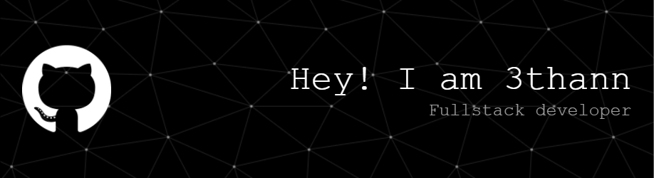

## Présentation 

🎓 - Développeur web junior  
💻 - Étudient à Open Campus  

### Compétences :
 * Intégration statique
 * Framework Laravel
 * Base de données relationelle -> PhpMyAdmin, CLI
 * Python -> Programmation dynamique, fonctionnelle et orienté objet
 * Git bash
